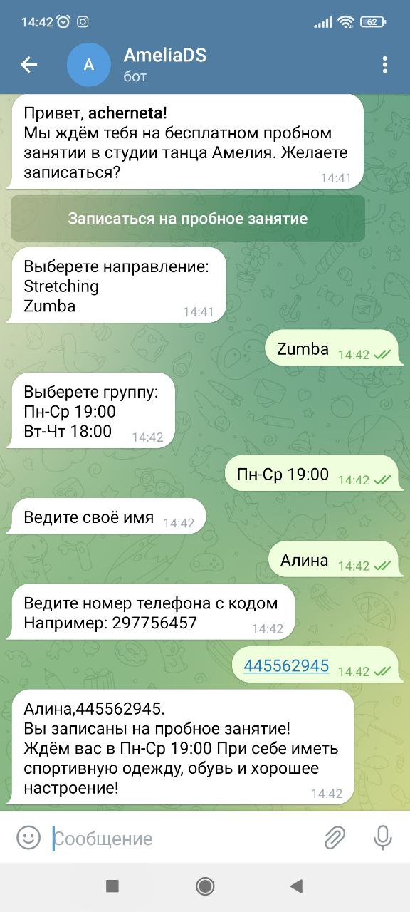
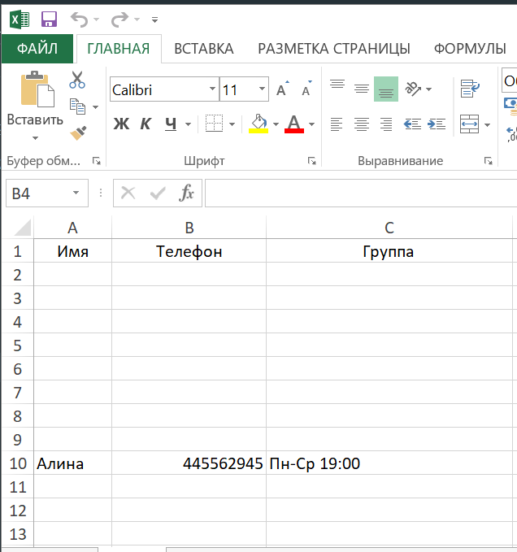

# OverOne
## Телеграмм-бот @AmeliaDS
[_Ссылка на телеграмм-бот_](http://t.me/AmeliaDS_Bot)
___
### Описание
##### Телеграмм-бот @AmeliaDS, предназначенный для регистрации клиентов и записи их данных в таблицу Microsoft Excel, что позволяет получить результаты по привлечению клиентов, помогает развивать малый бизнес. Упрощает работу людей, не владеющих широкими навыками в работе с компьютером, ведь освоит Microsoft Excel, проще, чем база данных. Наличие QR-кода на бумажных носителях рекламы, получение процесса записи и получение большего количества запросов клиентов.
___
### Библиотеки
```
import telebot
from telebot import types
from openpyxl import load_workbook
```
___
### Как использовать Телеграмм-бот
##### 1. потенциальных пациентов
###### _1.1 Отсканировать QR-код на бумажных носителях рекламы или перейти по ссылке на телеграмм-бот._
###### _1.2 Запустить бот. Нажать кнопку "Старт" и "Записаться на пробное занятие"._
###### _1.3 Ввести выбранные вами данные вручную, как показывает бот._

##### 2. Сотрудникам
###### _2.1 Открыть фойл "my_bot.xlxs" в Microsoft Excel, лист "record"._

